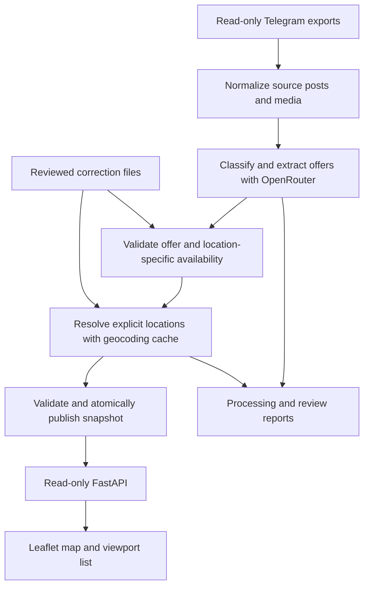

# Telegram food deals map: implementation plan

Status: **draft for user review; implementation has not started**. Prepared 2026-09-06 from [mvp_draft.md](../../mvp_draft.md), [thoughts.md](../../thoughts.md), and the local August exports.

## Goal and recommended approach

Build a local application that makes it easy to inspect food offers around an area of Singapore. Process manually exported Telegram data through an offline pipeline, publish a validated JSON snapshot, and serve it with FastAPI and a lightweight Leaflet interface. The browser and API must work from existing results without calling an LLM or geocoder.

The proposed stack is appropriate for this data volume. The significant work is interpreting the data correctly: a post can contain multiple offers, an offer can cover multiple locations, and each location can have different dates. Keep these relationships explicit internally, then publish a separate normalized deal row for each offer/location pairing, as requested in the notes.

The initial data contains 139 records, including 136 text-bearing posts, 132 available photos, two pin-service records, one poll, and four omitted videos/animations. See [the data review](01-data-review.md) for measured findings and concrete edge cases. Extraction and mapping coverage have not yet been measured.

## Decisions for review

The following questions were raised during planning. Until answered, the recommendations below define the provisional draft, not confirmed requirements.

| Decision | Recommended first version | Effect of choosing more scope |
| --- | --- | --- |
| Deals saying “all/selected/most outlets” without a branch list | Retain as unmapped; map only explicit supported locations | Branch discovery needs a separate source of outlet and participation evidence, with exclusions and freshness tracking. |
| Extraction inputs | Caption text and text/link metadata; retain images for display | Reading images adds cost, conflict resolution, and a vision evaluation step. Following links adds fetching and content-extraction work. |
| Date handling beyond start/end | Support explicit dates, ranges, and weekdays; display time/holiday restrictions as text | Start/end only is simpler, but can show separate-date offers on invalid days. If selected, label results as within an advertised period rather than active that day. |

Confirmed from the source notes: duplicate an offer into separate normalized rows for its locations; leave unspecified date boundaries null; an absent end date does not automatically expire an offer; assign marker numbers from the current viewport.

Other proposed defaults are recorded as review questions in the phase plans. Most can be resolved within the corresponding phase. In particular, define relevance broadly enough to include food/drink offers and free samples, while excluding unrelated advertising; flag mixed entertainment/product promotions for review.

## MVP scope

Included:

- Manual imports of the three existing exports and repeatable imports of later exports in the same format.
- Lossless source traceability, semantic relevance classification, structured offer/location/date extraction, and persistent caches.
- Conservative Singapore geocoding of explicit locations, with a small file-based manual correction process.
- Validated mapped and unmapped results, plus a processing report that explains exclusions and failures.
- A local read-only FastAPI API, safe source-image serving, and static HTML/CSS/JavaScript.
- A Leaflet map and viewport-aware deal list with matching ephemeral numbers and synchronized selection.
- A visible reference-date selector, optional post-age filter, and historical browsing for the August data.

Deferred: automatic Telegram ingestion, scheduled jobs, accounts, database, deployment infrastructure, automated campaign deduplication, branch discovery, linked-page ingestion, vision extraction under the provisional scope, sophisticated search, and exact “redeemable right now” checks for opening hours, holidays, stock, or membership.

## Phase order and review gates

| Phase | Plan | Deliverable | Completion gate |
| --- | --- | --- | --- |
| 1 | [Preprocessing and shared contracts](02-preprocessing.md) | Local importer, typed contracts, normalized source snapshot, media manifest, import report | All 139 records accounted for; 136 text candidates; hidden URLs preserved; repeat import is idempotent. |
| 2 | [LLM extraction and availability](03-llm-processing.md) | Structured extraction cache, expanded offer/location rows, date evaluator, review output | Small annotated pilot reviewed; no invented branch expansion; location/date associations pass edge cases. |
| 3 | [Geocoding and dataset publication](04-geocoding.md) | Cached location resolutions, manual overrides, validated published snapshot | Every accepted pilot pin reviewed; unresolved locations retained; repeat run avoids cached network requests. |
| 4 | [FastAPI](05-fastapi.md) | Read-only API and safe assets/media routes | API works without provider keys; date/filter behavior and failure responses are verified. |
| 5 | [Leaflet and end-to-end evaluation](06-leaflet.md) | Usable map/list interface | Numbering, selection, overlapping pins, historical dates, and empty/error states work on the supplied data. |

Complete and review each phase before expanding scope. Phases 1–3 produce independently inspectable data artifacts. Phase 4 can begin with a small validated fixture once the shared schema is agreed; Phase 5 can then use that API while geocoding coverage is reviewed. This is sequencing guidance, not a request to implement concurrently now.

## Architecture



Use ordinary Python modules and explicit CLI stages. Pydantic contracts, an HTTP client, FastAPI, and an ASGI server are sufficient; avoid a workflow framework or database for this batch size. Keep external-service clients behind small interfaces so validation and API behavior can be tested without the network. Resolve dependency compatibility with Python 3.14 during Phase 1 and keep versions in the `uv` lockfile.

Suggested layout, to be created during implementation:

```text
src/food_deals_mvp/
  cli.py                  # normalize / extract / geocode / publish / report
  config.py
  models.py               # stage and public contracts
  storage.py              # validated reads, atomic writes, run manifests
  preprocessing.py
  extraction.py           # prompt/schema and OpenRouter adapter
  availability.py         # one deterministic date evaluator
  geocoding.py            # query building, provider adapter, matching
  publishing.py
  api.py
  static/                 # HTML, CSS, JS, pinned Leaflet assets
config/sources.json       # source IDs and verified public usernames
data/intermediate/        # versioned local stage artifacts
data/cache/llm/
data/cache/geocoding/
data/overrides/            # reviewed corrections with evidence
data/published/           # deals.json and allowlisted media
data/reports/
tests/                    # focused fixtures and checks, subject to approval
```

This layout names responsibilities, not a requirement to create every file immediately. Add modules when their phase needs them. Keep generated artifacts and secrets out of source control; keep schemas, prompts, selected fixtures, and deliberately reviewed correction/config files reviewable.

## Shared data contract

Use `schema_version` on each artifact and a run manifest with input hashes, relevant configuration/prompt/model versions, generation timestamp, stage counts, and failure counts. Separate stable identity from mutable content and cache fingerprints.

| Entity | Minimum fields and rules |
| --- | --- |
| Source post | `post_id = telegram:<channel_id>:<message_id>`, numeric IDs, source name, configured username/nullable Telegram URL, timezone-aware `posted_at` and `edited_at`, exact flattened text, original text/entities reference, extracted links, media references/status, source file, source-content hash, extraction-input hash. |
| Post extraction | `post_id`, processing status, relevance (`food`, `non_food`, `uncertain`), reason/evidence, zero or more offers, prompt/schema/model/provider metadata. A successful empty result is distinct from a failed request. |
| Offer | Application-assigned `offer_id`, source reference, grounded title/description, merchant if known, terms, availability, location scope (`explicit`, `all_outlets`, `selected_outlets`, `online_only`, `unspecified`), exclusions, zero or more explicit locations, supporting caption evidence. |
| Location candidate | Application-assigned key, original location text, venue/building/address/unit components when supported, evidence, effective location-specific availability. Do not infer a full address from model memory. |
| Location resolution | Candidate/query key, normalized query, provider/version, status (`matched`, `ambiguous`, `not_found`, `not_attempted`, `error`), selected result and candidate evidence, latitude/longitude or null, precision (`outlet`, `building`), lookup time, optional reviewed override. |
| Published deal row | `deal_id`, `post_id`, `offer_id`, source/title/description/terms, posting date, effective availability, original location label/scope, mapping status/reason, nullable coordinate pair, precision, safe image URL, Telegram URL and information links. One row per explicit offer/location pairing; an offer with no explicit location has one unmapped row. |

Keep source IDs stable across edits. Assign offer and candidate keys deterministically from validated semantic content within a post; do not depend on the LLM array order or ask it to generate IDs. Unchanged cached input/output must preserve row IDs. A substantive offer/location correction can replace its derived ID; record that relationship in the run report and invalidate associated stale overrides. Cross-channel campaign identity is deferred.

Date fields remain dates, not UTC-midnight timestamps. `availability` contains `start_date`, `end_date`, optional `valid_dates`, optional ISO `weekdays` (Monday=1), `restrictions_text`, and a parsing/review status. Null boundaries mean unspecified, not extraction failure. A row receives the availability applicable to that offer at that location; explicit local overrides take precedence over shared fields. The extraction plan defines the evaluator and ambiguous-date behavior.

Published JSON uses named `latitude` and `longitude` fields in WGS84 decimal degrees; the client passes `[latitude, longitude]` to Leaflet. Do not store Web Mercator coordinates or confuse GeoJSON's reverse array order with Leaflet's order. Exact unit-level positioning is not promised when the matched place is a building.

The single published `deals.json` envelope contains `schema_version`, `dataset_id`, `generated_at`, `timezone`, `source_date_range`, processing summary, and `deals`. Mapped rows require a finite valid coordinate pair and accepted precision; other rows require both coordinates null. The API exposes public fields only, never raw LLM responses, cache files, local absolute paths, or secrets.

## Availability and historical data

Default the reference date to the current date in `Asia/Singapore`; always show it and allow changing it. Exclude posts published after the reference date. Known start/end dates are inclusive. An unspecified start adds no lower bound beyond the posting date, and an unspecified end adds no expiry. Explicit date lists and weekdays further constrain eligibility under the recommended scope.

Call the filter “Valid on selected date”; display unknown expiry and unevaluated restrictions clearly. It does not assert stock availability or eligibility at the current time. Do not persist a time-dependent `is_active` flag in the dataset. Compute it through the same backend evaluator for every request.

Default the optional post-age limit to off, preserving the requested no-expiry rule. When enabled, explain it as “Posted within N days”, separate from advertised validity. Historical evaluation uses a saved export containing later edits; it is not a reconstruction of exactly what Telegram showed on a past date.

## Reliability and evaluation

- Each CLI stage validates its input and produces a report, even when individual records fail. Broken input structure/configuration fails the stage clearly; individual provider failures are resumable and visibly incomplete.
- Cache keys include the inputs and settings that affect that stage. Do not invalidate LLM results because unrelated reaction counts changed; do invalidate them when text, date context, prompt, model, or extraction schema changes.
- Use one writer, checkpoint completed provider work, and atomically replace final JSON. Publish only a validated snapshot. Partial processing requires explicit operator selection and produces a visible incomplete-data summary; never silently drop failures and call the run complete.
- Require IDs/counts to reconcile across stages, and review false positives as well as mapping coverage. Record manual corrections separately from raw evidence.
- Proposed pilot target: review every mapped pilot row and resolve or remove every known incorrect pin before serving it. Record extraction correctness on the annotated slice and actual coverage/cost before deciding on a model or broader enrichment. Do not invent an accuracy percentage before obtaining labels.
- Final usefulness check: inspect a few Singapore areas on August 9, August 18, and the current date; confirm source links and terms are accessible, and decide whether the number of correct useful offers justifies expanding the data sources.

Proposed validation during implementation: `uv run ruff check`, `uv run ty check`, and `uv run pytest`, with external services stubbed in automated tests. Frontend state logic should have focused checks plus a manual browser pass. Per [AGENTS.md](../../AGENTS.md), implementing a feature is followed by a separate proposal/approval for adding or changing tests and user documentation; this planning request authorizes these plan documents only. Do not create application code until the user reviews the plan.

## External services

**Public Nominatim is a conditional option for a small one-time job.** Its [usage policy](https://operations.osmfoundation.org/policies/nominatim/) imposes request-rate, caching, identification, and bulk-use restrictions. Review the concrete controls in [Phase 3](04-geocoding.md) before using the provider named in the original draft.

Leaflet and FastAPI are the requested application stack. Model/provider selection remains configurable rather than committing to an untested “cheap” model. Technical references and provider-specific requirements are linked in the corresponding phase plans; they were checked on 2026-09-06.

## Possible later phases

After evaluating the text-only map, prioritize using measured failure categories:

1. Vision extraction for posts where images add useful locations or materially different terms; retain image evidence and flag text/image conflicts.
2. Curated branch lists with evidence of promotion participation and explicit exclusion handling. Do not use an LLM or geocoder as an authoritative outlet directory.
3. Selective linked-page enrichment with bounded fetches, redirect validation, content snapshots, and freshness tracking.
4. Campaign deduplication that preserves all sources and conflicting conditions.
5. Automated ingestion, scheduled processing with an appropriate geocoding provider, then database/deployment work if usage warrants it.
